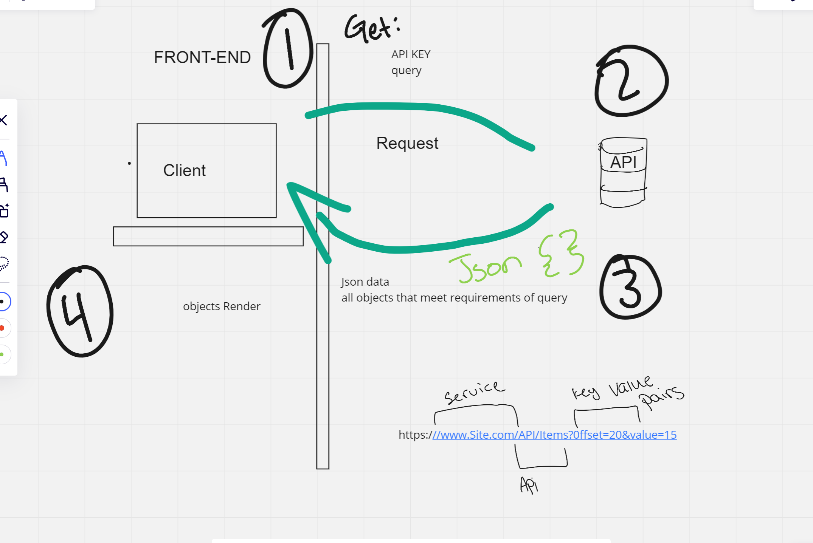

**Version**: 1.0.0 (increment the patch/fix version number if you make more commits past your first submission)

## Overview
users can see a map of location searched by user

# User Stories
Given that a user enters a valid location in the input, When the user clicks the "Explore!" button, Then the latitude and longitude will be displayed on the page.

## Getting Started
git clone project
npm i project
npm start

## Architecture
- react
- javascript

## Change Log
<!-- Use this area to document the iterative changes made to your application as each feature is successfully implemented. Use time stamps. Here's an example:

01-01-2001 4:59pm - Application now has a fully-functional express server, with a GET route for the location resource. -->

## Credit and Collaborations

Name of feature: Init

Estimate of time needed to complete: 30 min

Start time: 1:30

Finish time:2 

Actual time needed to complete:30 min

Name of feature: 
Estimate of time needed to complete: 
Start time: 
Finish time:
Actual time needed to complete:

---------------------------------

------------------------------

## Authors
Tanner Percival

------------------------------

For more information on Markdown: https://www.markdownguide.org/cheat-sheet

