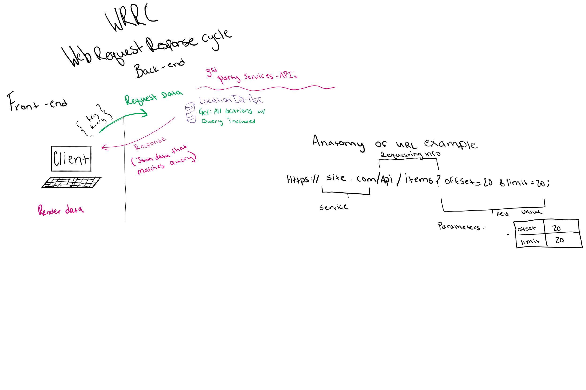
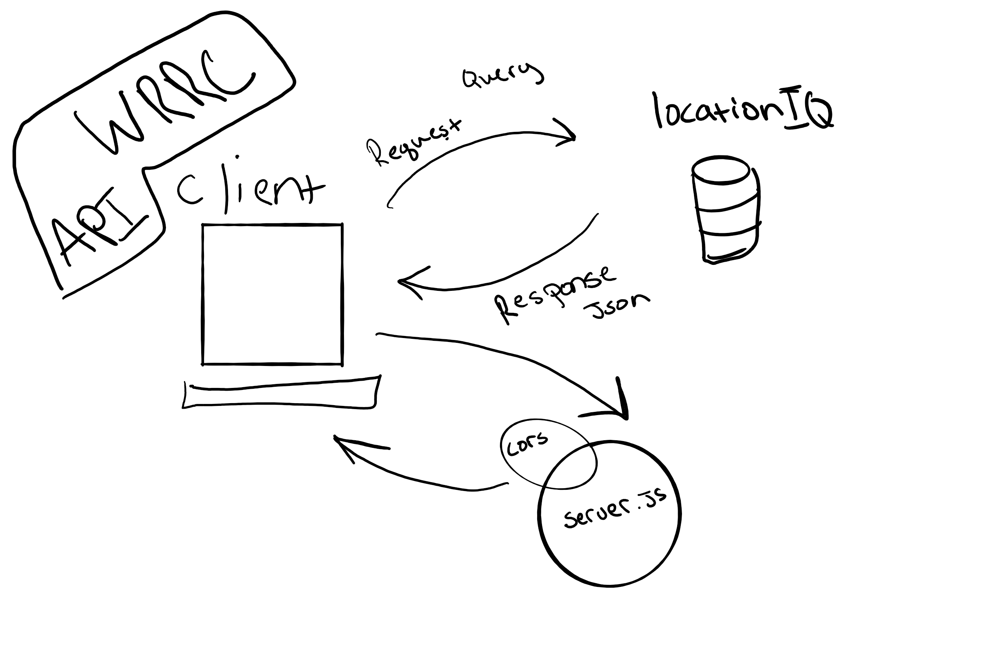
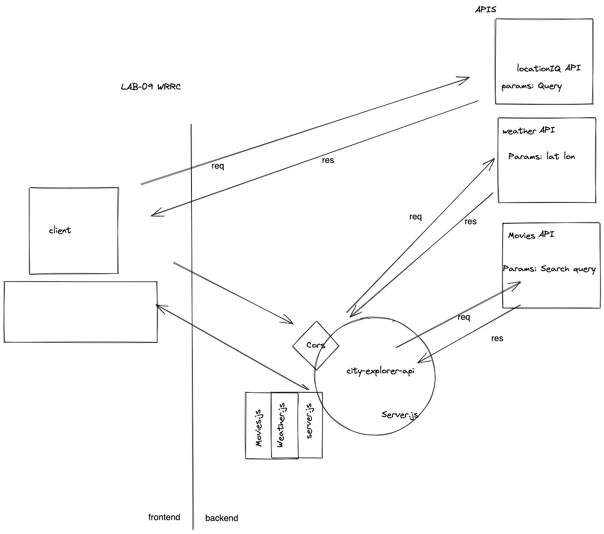
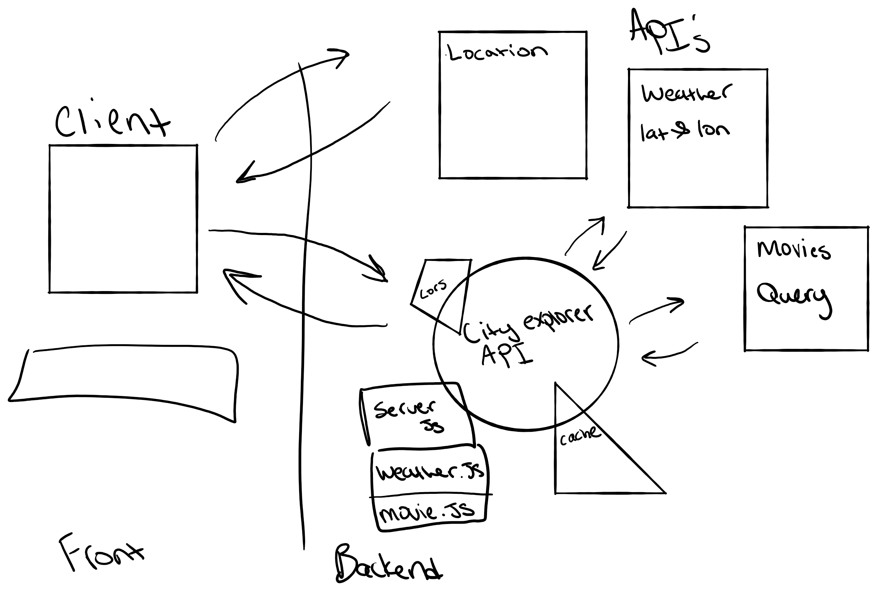

**Version**:
 1.0.0 (increment the patch/fix version number if you make more commits past your first submission)

## Overview

users can see a map of location searched by user

# User Stories
Given that a user enters a valid location in the input, When the user clicks the "Explore!" button, Then the latitude and longitude will be displayed on the page.

## Getting Started

git clone project
npm i project
npm start

## Architecture

- react
- javascript

## Change Log

01-01-2022 Application now has a fully-functional express server, with a GET route for the location resource. -->

## Credit and Collaborations

Name of feature: Init

Estimate of time needed to complete: 30 min

Start time: 1:30

Finish time:2 

Actual time needed to complete:30 min

Name of feature: locations
Estimate of time needed to complete: 1 hr 
Start time: 4
Finish time:530
Actual time needed to complete:130
Name of feature: maps
Estimate of time needed to complete: 30 min
Start time: 530
Finish time:630
Actual time needed to complete:1hr
Name of feature: error
Estimate of time needed to complete: 1 hr
Start time: 7
Finish time:930
Actual time needed to complete:2 and a half hourss
Name of feature: weather (live)
Estimate of time needed to complete: 1 hr
Start time: 1:15
Finish time:2:15
Actual time needed to complete:1hr
Name of feature: Movies
Estimate of time needed to complete: 1 hr
Start time: 2:30
Finish time: 4:30
Actual time needed to complete:2 hr
Name of feature: deploy
Estimate of time needed to complete: 15 min
Start time: 5
Finish time: 6
Actual time needed to complete: 1 hour
Name of feature: Modularize
Estimate of time needed to complete: 3 hr
Start time: 1:30 pm
Finish time: 2:22
Actual time needed to complete: 1hr
Name of feature: Componetize
Estimate of time needed to complete: 3hr 
Start time: 2:30
Finish time: 3:20
Actual time needed to complete: 50 min
Name of feature: Caching
Estimate of time needed to complete: 2hr 
Start time: 1:40
Finish time: 2:55
Actual time needed to complete: 2 hours 30 min

---------------------------------

------------------------------

## Authors
Tanner Percival

------------------------------

For more information on Markdown: https://www.markdownguide.org/cheat-sheet

